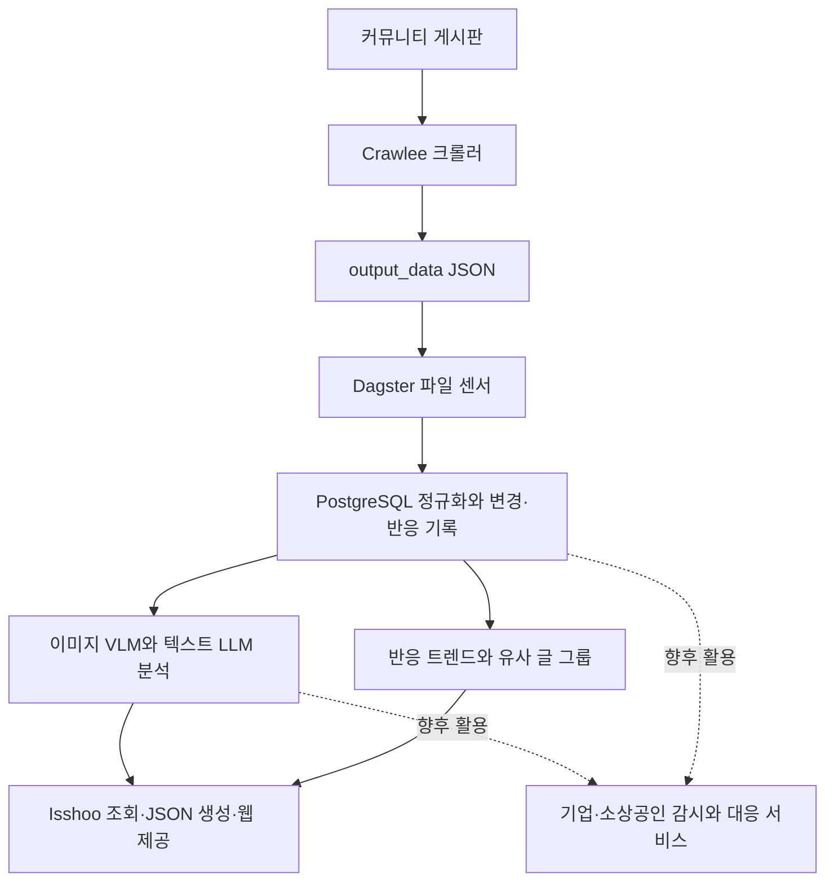

# Isshoo 프로젝트 이해와 문서 안내

기준일: **2026-10-04, Asia/Seoul**. 이 문서는 사용자의 사업 설명과 현재 작업 트리의 문서·소스 조사 결과를 정리한 인수인계 시작점이다.

## 1. 프로젝트의 사업 방향

사용자가 설명한 핵심 자산은 **커뮤니티 데이터를 수집하고 분석·분류·그룹화하는 공통 기술**이다. Isshoo는 이 기술을 먼저 적용하는 대중용 콘텐츠 서비스이며, 이후 별도의 기업·소상공인용 서비스에서도 같은 기술을 활용한다.

| 구분 | 역할과 목표 | 현재 상태 |
|---|---|---|
| 대중용 Isshoo | 여러 커뮤니티의 재미있는 글과 이슈를 모아 보여주고 사용자 확보 | 피드·검색·키워드·상세 리더 등의 코드 구현 |
| 공통 수집·분석 기술 | 본문·댓글·미디어 수집, 정규화, AI 분석, 유사 글 그룹화, 변화 추적 | 별도 `dag` 저장소에 파이프라인 구현 |
| 기업·소상공인용 서비스 | 기업·상품에 대한 평판과 관심 키워드 감지, 새로운 글·댓글 확인, 빠른 대응 지원 | 사업 방향이며 제품 기능은 아직 확인되지 않음 |
| 수익화 | 대중용 사이트의 Google AdSense 등 광고, 니즈가 있는 기업 사용자의 유료 전환 또는 별도 유료 서비스 | 사용자 구상이며 광고·결제·구독 구현은 조사 범위에서 확인되지 않음 |

이 설명은 2026-10-04 사용자 설명을 기준으로 한다. 기존 문서는 주로 대중용 큐레이션을 다루므로, 장기 사업 방향을 이해할 때 이 설명을 함께 읽는다. 첫 유료 고객군, 가격, 상품 구성, 감지·대응 범위는 이 대화에서는 아직 확정하지 않았다.

## 2. 다음 채팅에서 읽을 문서

| 문서 | 담고 있는 내용 |
|---|---|
| [웹 구현 현황](doc/WEB_IMPLEMENTATION.md) | 페이지·로그인 동선·검색·읽음 기록·JSON 제공·구현 제한 |
| [데이터 파이프라인](doc/DATA_PIPELINE.md) | 크롤러·Dagster·정규화·LLM/VLM·클러스터링·재수집 점검 항목 |
| [문서 싱크 차이](doc/DOCUMENTATION_DRIFT.md) | 기존 문서와 코드가 다른 부분, 운영 확인 사항, 이후 현행화 순서 |
| [업그레이드 인수인계](doc/UPGRADE_HANDOFF.md) | 현재 의존성 버전, 업그레이드 순서 제안, 회귀 검증, 별도 채팅용 요청문 |

프로젝트 파악은 이 README부터, 라이브러리 업데이트 작업은 [업그레이드 인수인계](doc/UPGRADE_HANDOFF.md)부터 시작하면 된다.

## 3. 조사 범위와 사실의 구분

- **사용자 설명:** 위 사업 방향과 수익화 구상.
- **코드 확인:** 현재 파일에 실제로 존재하는 구현과 설정.
- **정적 점검 항목:** 소스 간 불일치나 누락 가능성. 실제 장애·데이터 유실로 확인한 것은 아니다.
- **운영 미확인:** 배포 주소의 상태, 워커·스케줄 활성 여부, DB의 실제 스키마·데이터, 처리 성능과 비용.
- **제안:** 향후 제품·기술 방향과 작업 순서. 이미 구현되거나 확정된 계획으로 읽지 않는다.

조사에서는 DB 연결, 크롤링, LLM/VLM 호출, 빌드, 배포를 수행하지 않았다. 로컬의 오래된 생성 JSON은 운영 상태의 증거로 사용하지 않았다. 새 문서 작성 과정에서도 애플리케이션 코드와 의존성은 수정하지 않았다.

조사 당시 Git HEAD는 `is: e7b84c624970f8466b6ca08a83a269f1a04783e9`, `dag: afd31f60435dce679c76f90b711580fef65f1f65`였다. **HEAD와 작업 트리는 동일하지 않다.** 시작 시 `components/server-time.client.tsx`, `components/sidebar.tsx`, `lib/schema.ts`에 기존 사용자 변경이 있었고, 조사는 현재 작업 트리를 기준으로 했다. 이후 채팅에서는 실제 상태를 다시 확인한다.

## 4. 저장소와 전체 흐름

| 위치 | 책임 | 주요 진입점 |
|---|---|---|
| 이 저장소 `is` | Next.js 웹, PostgreSQL 조회, JSON·검색 인덱스 생성, 웹 배포 | [package.json](package.json), [lib/queries.ts](lib/queries.ts), [빌드 워크플로](.github/workflows/build-contents.yml) |
| 인접 저장소 `../dag` | 여러 도메인을 함께 운영하는 Dagster 프로젝트. IS 수집·분석 포함 | [definitions.py](../dag/dag/definitions.py), [IS 수집 실행기](../dag/dag/is_node.py), [기존 IS 문서](../dag/docs/is.md) |

아래 흐름은 현재 코드의 책임 구분이며, 운영 시스템이 실제 정상 가동 중이라는 의미는 아니다.

웹의 [Drizzle 스키마](lib/schema.ts)와 `dag`의 SQL 처리는 같은 도메인 테이블에 의존한다. 웹 의존성 업데이트와 DB 구조 변경은 구분해 진행하고, 스키마 변경 시 양쪽 소비자·작성자를 함께 검토한다.

## 5. 이미 확보한 기술과 기업용 확장 과제

현재 코드에는 원문 URL·본문·HTML·댓글 관계·수집 시각, 본문 변경 이력, 반응 스냅샷, 이미지 OCR·설명, LLM 분류·키워드, 유사 게시물 묶음이 있다. 이는 기업용 서비스에도 활용할 수 있는 기반이다.

다만 다음 차이는 제품을 설계할 때 유지해야 한다.

| 현재 대중용 판단 | 기업용에서 추가로 필요한 판단 |
|---|---|
| 주목받는 글 중심 수집, 일부 일반 게시판 포함 | 고객 언급이 실제 발생하는 소스와 작은 최초 신호의 수집 범위 |
| 카테고리·핵심 키워드 | 기업·상품 식별, 동명이인·별칭 구분, 대상별 불만·평판·대응 필요성 |
| 비슷한 내용·재게시물 그룹화 | 표현이 다른 글도 같은 사건·문제·대상으로 연결하는 의미 기반 그룹화 |
| 인기 순위와 노출 회전 | 고객별 감지 우선순위, 중복 알림 제어, 알림 근거와 처리 상태 |
| 게시글 중심 분석, 선택적인 댓글 입력 | 신규 댓글·수정·삭제를 계기로 한 분석 및 감지 이벤트 |

현재 LLM의 주요 산출물은 카테고리와 키워드이며, 댓글 입력은 기본 설정상 비활성이다. 그룹화의 핵심은 SimHash/MinHash와 미디어 유사도이며, 의미 임베딩 기반 사건 그룹화가 아니다. 고객별 감시 대상, 평판 분석, 알림, 대응 작업함, 조직·권한, 결제는 이번 조사에서 구현을 확인하지 못했다.

현재 [분석 우선순위 승격](../dag/dag/is_data_unsync.py)의 일부는 웹 노출 상태와 연결된다. 향후 기업용에서는 고객이 감시하는 대상의 중요도를 별도로 반영하고, 화면의 과노출 방지 규칙이 기업용 신호 누락으로 이어지지 않도록 설계한다.

## 6. 향후 작업 방향 — 제안

사용자가 설명한 다음 작업은 **별도 채팅에서 라이브러리를 최신 버전으로 업데이트한 뒤 문서 싱크를 현행화하는 것**이다. 이번 문서화는 그 작업의 기준점이며 업그레이드를 수행한 결과가 아니다.

그 이후 제품·파이프라인 고도화에서는 다음 순서가 유용하다.

1. 소스별 수집 성공·누락, 댓글 재수집, 분석 대기 시간·실패율·정확도·처리 비용을 확인한다.
2. 공통 데이터·분석 결과와 대중용 랭킹·기업용 감지 규칙의 책임을 정리한다. 별도 서버·패키지로 분리할지는 요구가 확인된 뒤 결정한다.
3. 대중용 피드의 검색·상세·공유·갱신 동선을 안정화하며, 첫 유료 고객군의 작은 사용 시나리오를 검증한다.
4. 예를 들어 “내 기업·상품의 새 언급을 모아 불만 내용과 원문 근거를 알려주는 기능”부터 검증하고, 알림·대응 기록·과금 범위를 구체화한다.

첫 고객이 기업인지 소상공인인지, 기대 감지 지연, 실제 언급 소스, 수동 대응 지원인지 자동 대응까지 원하는지는 후속 제품 논의에서 정할 사항이다.

## 7. 기존 문서의 위치

[GEMINI.md](GEMINI.md), [기존 로드맵](doc/IS_ROADMAP.md), [페이지 명세](doc/spec.md), [UI 문서](doc/ui.md), [서비스 문서](doc/service.md), 배포·DB 설정 문서는 설계 이력과 기존 가이드로 남긴다. 확인된 싱크 차이는 [문서 싱크 차이](doc/DOCUMENTATION_DRIFT.md)에 모았다.

소스와 기존 가이드가 다르면 현재 코드와 실제 운영 검증을 우선한다. 업그레이드 후에는 변경된 구현과 검증 결과를 근거로 문서를 갱신하고, 이 기준일과 상태도 함께 업데이트한다.
